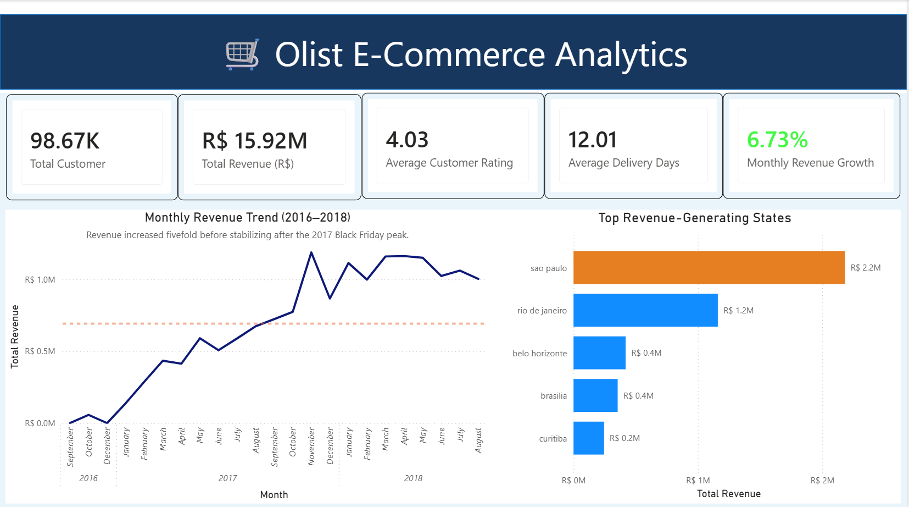
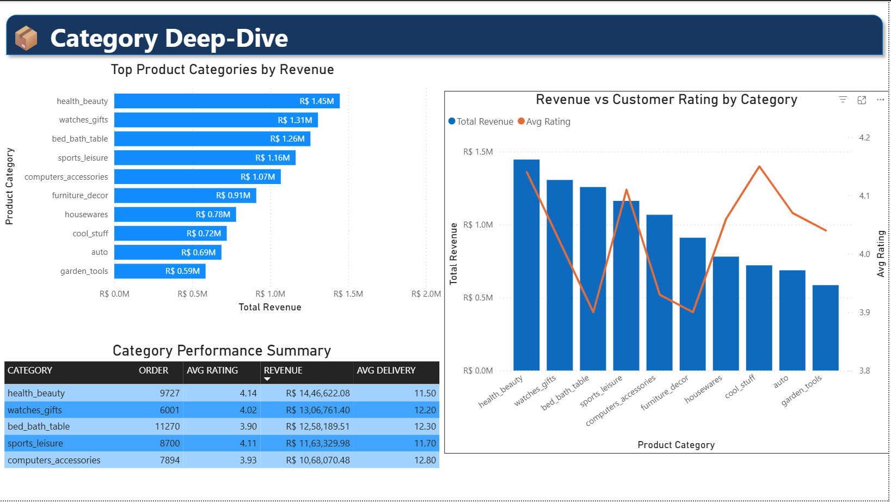
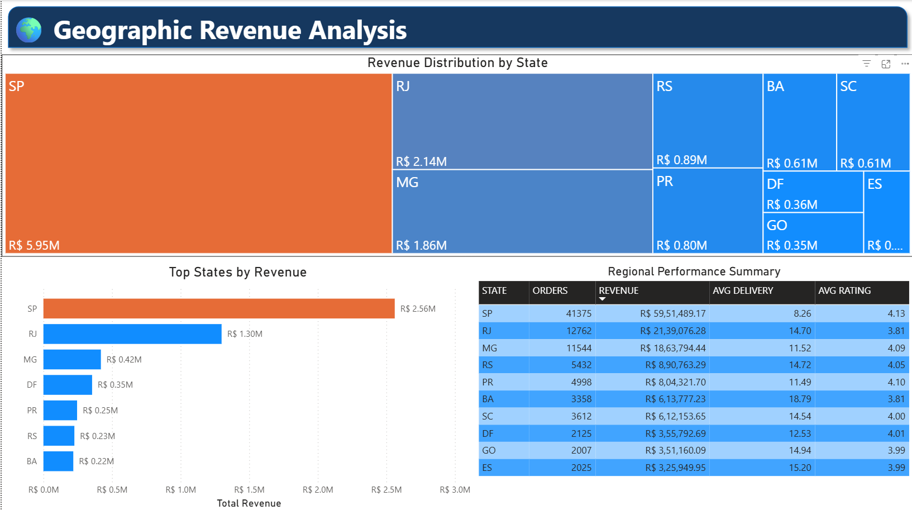

# 🛒 Olist E-Commerce Business Analytics Dashboard

> An end-to-end Business Intelligence and Analytics project built using **PostgreSQL, SQL, Python, Power BI, and DAX** to analyze the Brazilian Olist E-Commerce dataset and deliver actionable business insights.


---

# 📌 Project Overview

This project analyzes the **Brazilian Olist E-Commerce Dataset** containing over **99,000 orders** across multiple business dimensions.

The objective was to transform raw transactional data into executive-level business insights by designing a complete analytics pipeline consisting of:

- Data Cleaning
- Data Modeling
- SQL Analysis
- Exploratory Data Analysis (EDA)
- Customer Segmentation (RFM)
- Interactive Power BI Dashboard
- Business Recommendations

The dashboard enables stakeholders to monitor revenue trends, customer behaviour, product performance, delivery efficiency, and regional sales performance.

---

# 🎯 Business Objectives

The dashboard answers key business questions such as:

- Which states generate the highest revenue?
- Which product categories contribute the most sales?
- How has revenue grown over time?
- How do delivery times affect customer ratings?
- Which customers are at risk of churn?
- Where should the business focus expansion efforts?
- Which customer segments deserve targeted marketing campaigns?

---

# 📊 Dashboard Pages

## 📈 Page 1 — Executive Business Overview

Provides a high-level summary of business performance.

### KPIs

- Total Revenue
- Total Orders
- Monthly Revenue Growth
- Average Customer Rating
- Average Delivery Time

### Visuals

- Monthly Revenue Trend
- Top Revenue Generating States

---

## 📦 Page 2 — Product Category Analysis

Analyzes category performance and customer satisfaction.

### Visuals

- Top Product Categories by Revenue
- Revenue vs Customer Rating
- Category Performance Summary

Business Insights:

- Identify high-performing categories
- Detect categories with high revenue but lower customer satisfaction
- Compare delivery performance across categories

---

## 🌍 Page 3 — Geographic Revenue Analysis

Analyzes regional business performance.

### Visuals

- Revenue Distribution by State
- Top Revenue States
- Regional Performance Table

Business Insights:

- Highest revenue generating states
- Regional growth opportunities
- Revenue concentration analysis

---

## 👥 Page 4 — Customer Segmentation (RFM Analysis)

Customer segmentation using Recency, Frequency, and Monetary (RFM) analysis.

### Segments

- Champions
- Loyal Customers
- Potential Loyalists
- Recent Buyers
- At Risk
- Needs Attention

Business Recommendations are provided for every customer segment.

---

# 🛠 Tech Stack

| Technology | Purpose |
|------------|----------|
| Python | Data Cleaning & EDA |
| Pandas | Data Manipulation |
| PostgreSQL | Database |
| SQL | Data Modeling & Analytics |
| Power BI | Dashboard Development |
| DAX | KPIs & Time Intelligence |
| Git & GitHub | Version Control |

---

# 📂 Project Structure

```
olist-ecommerce-business-analytics
│
├── notebooks
│   ├── load_csvs_to_postgres.ipynb
│   └── 03_EDA_Insights.ipynb
│
├── sql
│   └── Olist_db_query.sql
│
├── powerbi
│   └── Olist_Ecommerce_Dashboard.pbix
│
├── screenshots
│   ├── executive_overview.png
│   ├── category_analysis.png
│   ├── geographic_analysis.png
│   └── customer_segmentation.png
│
└── README.md
```

---

# 🗄 Database Design

A consolidated **orders_fact** table was created using PostgreSQL by integrating:

- Customers
- Orders
- Order Items
- Products
- Reviews
- Payments

Additional analytical views include:

- monthly_revenue
- category_revenue
- state_sales

These optimized views simplify Power BI reporting and improve dashboard performance.

---

# 📈 Key Business Insights

### Revenue Growth

- Revenue increased approximately **5×** between 2016 and 2018.
- Significant spike observed during **Black Friday (November 2017)**.

---

### Geographic Insights

- São Paulo generates the highest revenue.
- MG and RS demonstrate expansion potential despite lower sales volume.

---

### Product Insights

- Health & Beauty is the highest revenue category.
- Certain categories exhibit strong sales but comparatively lower customer ratings.

---

### Customer Insights

- Nearly **50%** of customers belong to **At Risk** or **Needs Attention** segments.
- Champion customers generate significantly higher average spending.

---

# 💡 Business Recommendations

✔ Improve delivery efficiency to increase customer ratings.

✔ Launch retention campaigns targeting At Risk customers.

✔ Expand high-performing product categories into underpenetrated regions.

✔ Reward Champion customers with loyalty programs.

✔ Monitor delivery delays to reduce negative reviews.

---

# 📷 Dashboard Preview

## Executive Overview

<p align="center">

</p>

---

## Product Category Analysis

<p align="center">

</p>

---

## Geographic Analysis

<p align="center">

</p>

---

## Customer Segmentation

<p align="center">

</p>

---

# 📚 Dataset

Brazilian Olist E-Commerce Public Dataset

https://www.kaggle.com/datasets/olistbr/brazilian-ecommerce

---

